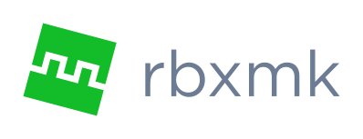

<a id="user-content-rbxmk" href="#user-content-rbxmk">
	
</a>

**rbxmk** is a command-line tool for manipulating Roblox files.

rbxmk is useful for development workflows that involve many separate files. If
your project is organized into a number of files, such as Lua files for
scripting and model files for assets, rbxmk makes it simple to combine these
files into a final product, be it a game, plugin, model, and so on.

## Download
**This project is unstable! Use at your own risk!**

The current version of rbxmk is **<version>v0.6.0</version>**. The following
builds are available for download:

| Windows                     | Mac                | Linux                       |
|-----------------------------|--------------------|-----------------------------|
| **[Windows 64-bit][win64]** | **[macOS][macos]** | **[Linux 64-bit][linux64]** |
| **[Windows 32-bit][win32]** |                    | **[Linux 32-bit][linux32]** |

See the [Release page][release] for more information on the current version.

[win64]: https://github.com/Anaminus/rbxmk/releases/download/v0.6.0/rbxmk-v0.6.0-windows-amd64.zip
[win32]: https://github.com/Anaminus/rbxmk/releases/download/v0.6.0/rbxmk-v0.6.0-windows-386.zip
[macos]: https://github.com/Anaminus/rbxmk/releases/download/v0.6.0/rbxmk-v0.6.0-darwin-amd64.zip
[linux64]: https://github.com/Anaminus/rbxmk/releases/download/v0.6.0/rbxmk-v0.6.0-linux-amd64.zip
[linux32]: https://github.com/Anaminus/rbxmk/releases/download/v0.6.0/rbxmk-v0.6.0-linux-386.zip
[source]: https://github.com/Anaminus/rbxmk/archive/v0.6.0.zip
[release]: https://github.com/Anaminus/rbxmk/releases/tag/v0.6.0

## Usage
The [Documentation page](doc/README.md) provides a complete reference on how
rbxmk is used.

## Installation
rbxmk can also be installed manually.

1. [Install Go](https://golang.org/doc/install)
2. [Install Git](http://git-scm.com/downloads)
3. Using a shell with Git (such as Git Bash), run the following command:

```bash
go install github.com/anaminus/rbxmk/rbxmk@latest
```

If you installed Go correctly, this will install the latest version of rbxmk to
`$GOPATH/bin`, which will allow you run it directly from a shell.

A specific version of rbxmk may be installed by replacing `latest` with a
version number (e.g. `v0.6.0`).

### Development
To compile and install the bleeding-edge version, the best way is to clone the
repository:

```bash
git clone https://github.com/anaminus/rbxmk
cd rbxmk/rbxmk
go install
```

Extra version information can be included by passing the `-X` flag to the
linker:

```bash
go install -ldflags="-X $VARIABLE=$VALUE"
```

- The `main.Prerelease` variable appends a prerelease version.
- The `main.Build` variable appends build metadata.

For example:
```bash
go install -ldflags="-X main.Prerelease=rc.1 -X main.Build=$(echo $(git log -1 --format=%cI | date --utc +%Y%m%d)-$(git rev-parse --short HEAD))"
rbxmk version
# e.g. 0.5.1-rc.1+20210312-2070bf8
```
